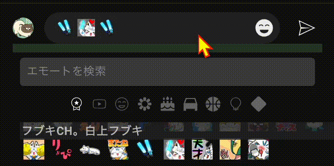

# YouTube Chat Helper - Chrome 拡張機能

## 概要
YouTube Chat Helper は、YouTube ライブチャットの入力体験を向上させる Chrome 拡張機能です。頻繁に使用するチャットメッセージをテンプレートとして保存し、すばやく再挿入できるようにすることで、繰り返しのチャット入力を効率化します。

## 機能
- チャット入力をワンクリックでテンプレートとして保存。
- 保存したテンプレートをチャット入力欄にすばやく挿入。
- テンプレートは YouTube チャンネルごとに保存。
- 右クリックで保存したテンプレートを削除可能。
- YouTube ライブチャットのフレームを自動検出。

## 使い方
### 1. チャット入力をテンプレートとして保存
- YouTube ライブチャットの入力欄にメッセージや絵文字を入力。
- 入力欄の下にカーソルを合わせると、ポップアップメニューが表示。
- **Save** ボタンをクリックしてメッセージをテンプレートとして保存。

### 2. 保存したテンプレートの挿入
- 保存されたメッセージは、入力欄の下にボタンとして表示。
- ボタンをクリックすると、テンプレートがチャット入力欄に挿入。

### 3. 保存したテンプレートの削除
- 保存されたボタンを右クリック。
- ポップアップメニューから **削除** を選択。

### 4. チャンネルごとのテンプレート管理
- テンプレートは YouTube チャンネルごとに保存されます。
- 別のチャンネルに切り替えると、そのチャンネル専用のテンプレートが表示されます。

## デモ
以下の GIF で拡張機能の使用方法を示します:

## インストール方法
1. 拡張機能のパッケージをダウンロード。
2. Chrome を開き、`chrome://extensions/` にアクセス。
3. **デベロッパーモード** を有効化（画面右上）。
4. **パッケージ化されていない拡張機能を読み込む** をクリックし、拡張機能のフォルダを選択。
5. 拡張機能がインストールされ、使用可能になります。

## 注意事項
- 拡張機能は YouTube ライブチャットページでのみ動作します。
- テンプレートを保存するためにローカルストレージを使用します。

## ライセンス
このプロジェクトはオープンソースであり、MIT ライセンスのもとで提供されます。

---

ファイル名: `README.md`

